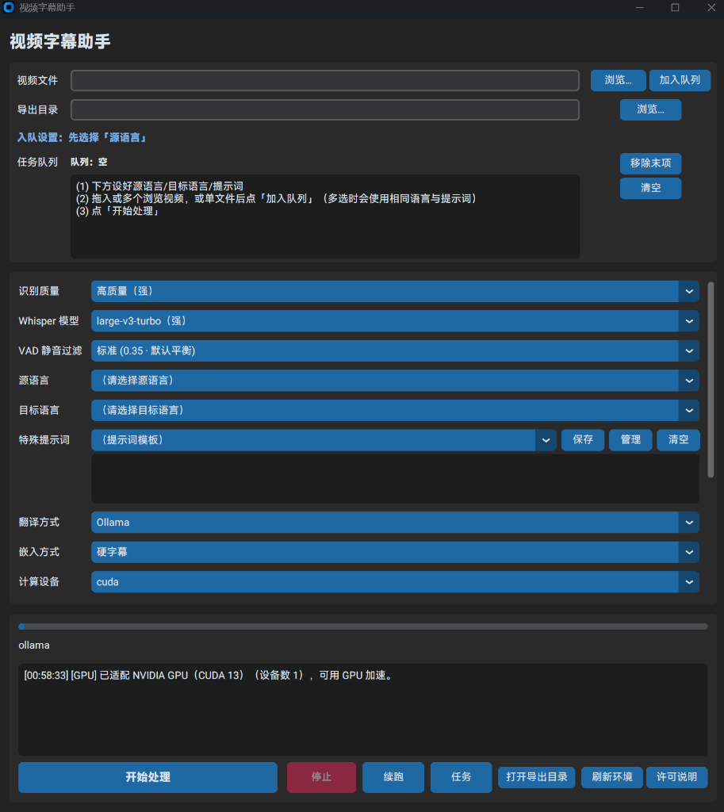

# 视频字幕助手 (Video Subtitle Helper)

一个基于 Python 与 CustomTkinter 开发的本地视频字幕自动化处理工具。实现从视频音频提取、Whisper 语音转写、大模型/API 字幕翻译，到最终硬字幕烧录或外挂轨打包的全流程处理。

---

## 📷 界面预览



---

## 核心功能

### 1. 全流程自动化处理
- **音频提取**：自动检索视频文件并高效抽取高质量音频轨道。
- **语音识别 (ASR)**：集成 `faster-whisper`。自动识别多语种并生成带精确时间戳的字幕片段（智能适配 NVIDIA CUDA 硬件加速与 CPU 自动降级）。
- **VAD 静音/幻觉过滤**：内置五档调节避免复杂背景噪点与重复字幕幻觉。
- **字幕翻译**：
  - **Ollama**：本地离线模型。
  - **OpenAI 兼容接口**：自由配置 Base URL 与 Model。
  - **传统机翻**：DeepL (Free/Pro)、百度翻译、谷歌翻译。
  - **不翻译**：支持直接输出原文字幕。
  - **提示词模板**：支持自定义提示词模板管理。

- **字幕导出与嵌入**：支持导出标准 `.srt` 外挂字幕文件，或直接合成高画质硬字幕视频轨 / 软字幕轨。

### 2.  GUI 界面核心功能
- **文件拖放与队列管理**：支持直接拖入视频文件一键添加，可视化管理任务队列，多个视频排队自动依次处理。
- **断点续传与步骤重试**：保留任务中间过程缓存，支持在「任务管理」中从任意指定阶段（音频提取 / 语音转写 / 字幕翻译 / 硬字幕烧录）重新重试。
- **历史任务流自动清理**：支持自定义历史任务日志与缓存的清理策略（永不 / 关闭应用时 / 保留 1、3、7 天）。
- **环境诊断与日志监控**：启动时自动检测 FFmpeg 及 CUDA 运行库，控制台日志实时更新进度。
- **配置自动保存**：所有参数修改自动保存至本地 AppData。

---

##  外部依赖与极简配置指南

> 💡 **自动下载提示**：**Whisper 语音识别模型权重无需提前手动寻找或下载**。软件在首次执行识别任务时，会自动在线连接 Hugging Face 并下载缓存至本地。

软件未内置 FFmpeg 二进制与驱动环境，按照下述命令或步骤即可完成安装配置：

### 1.  FFmpeg (必备：用于音视频提取与字幕硬烧录)

推荐使用 Windows 内置的包管理器一键安装（自动添加环境变量，无需手动配置）：

```powershell
winget install Gyan.FFmpeg
```

*（或使用 Scoop：`scoop install ffmpeg`）*  

重新打开终端窗口执行 `ffmpeg -version` 输出版本号即安装完成。程序启动时会自动检索系统安装路径。

### 2.  NVIDIA CUDA Toolkit (可选：用于开启 GPU 识别加速)

如显卡为 NVIDIA GPU 且需开启 GPU 识别加速：
1. 确保显卡驱动已更新至较新版本。
2. 前往 [NVIDIA CUDA Downloads](https://developer.nvidia.com/cuda-downloads) 下载并安装 **CUDA 12** 或 **CUDA 13** Toolkit。
3. "源码运行用户无需本节操作，requirements 已含运行库；本节适用于打包版 exe 用户"

*注：未安装 CUDA 时，软件会自动降级为 CPU 模式运行。*

### 3.  翻译后端配置说明

- **Ollama 本地大模型**：安装 [Ollama 客户端](https://ollama.com/) 并下载模型
- **OpenAI 兼容自定义 API**：填写 API Key 并调整 Base URL 与 Model
- **DeepL 翻译**：前往 [DeepL API 开发者平台](https://www.deepl.com/pro-api) 申请 API Key
- **百度翻译**：前往 [百度翻译开放平台](https://api.fanyi.baidu.com/) 申请 APP ID 与 密钥
- **谷歌翻译**：使用 [Google Translate](https://translate.google.com/) 网页接口

---

##  运行与打包说明

### 1. 源码运行

克隆代码库并安装依赖：

```bash
pip install -r src/requirements.txt
```

启动 GUI 界面：

```bash
python src/app.py
```

### 2. 命令行运行（可选）

```bash
python src/cli.py video.mp4 --to zh-CN --translator none --embed srt_only
```

`--source-lang` 默认为 `auto`（由 Whisper 自动检测源语言）；能确定源语言时建议手动指定（如 `--source-lang ja`），识别更稳。完整参数列表见 `python src/cli.py --help`。

### 3. 可执行程序打包

运行以下脚本：

```powershell
.\src\pack.bat
```

构建输出路径为 `dist/VideoSubtitleHelper_fast/VideoSubtitleHelper_fast.exe`。

---

## 项目结构

```text
video-subtitle-tool/
├── src/
│   ├── app.py           # CustomTkinter GUI 主界面与任务窗口逻辑
│   ├── pipeline.py      # 音频抽取、Whisper 识别、翻译调度、FFmpeg 烧录流水线
│   ├── translators.py   # Ollama / OpenAI / DeepL 等翻译后端接入与文本清洗
│   ├── cli.py           # 命令行运行入口
│   ├── requirements.txt # Python 依赖清单
│   ├── pack.bat         # 打包入口（环境检查后调用 pack.ps1）
│   ├── pack.ps1         # PyInstaller 全量打包脚本
│   ├── run.bat          # 本地快捷启动脚本
│   ├── update_dist.bat  # 增量热更新入口（调用 update_dist.ps1）
│   └── update_dist.ps1  # 增量热更新替换脚本
├── dist/                # 打包输出目录
├── THIRD_PARTY_NOTICES.md # 第三方组件许可说明
└── README.md            # 项目说明文档
```

---

## 配置与缓存路径

- **配置文件**：存储在 `%LOCALAPPDATA%\VideoSubtitleHelper\settings.json`。
- **字幕与导出来源归档**：处理过程产生的原文与译文 SRT 默认备份于程序根目录下的相对路径 `./exports/srt_archive/`（可在界面自定义导出目录）。
- **任务断点与缓存**：中间工作区默认存于相对路径 `./exports/jobs/<job_id>/`。
- **Whisper 模型缓存**：首次在线自动下载的模型默认缓存在 `%LOCALAPPDATA%\VideoSubtitleHelper\cache\` 或用户指定的模型目录中。

---

## 开源许可

本项目基于 [GNU General Public License v3.0 (GPL-3.0)](LICENSE) 许可发布。第三方组件许可与条款见 [THIRD_PARTY_NOTICES.md](THIRD_PARTY_NOTICES.md)。
